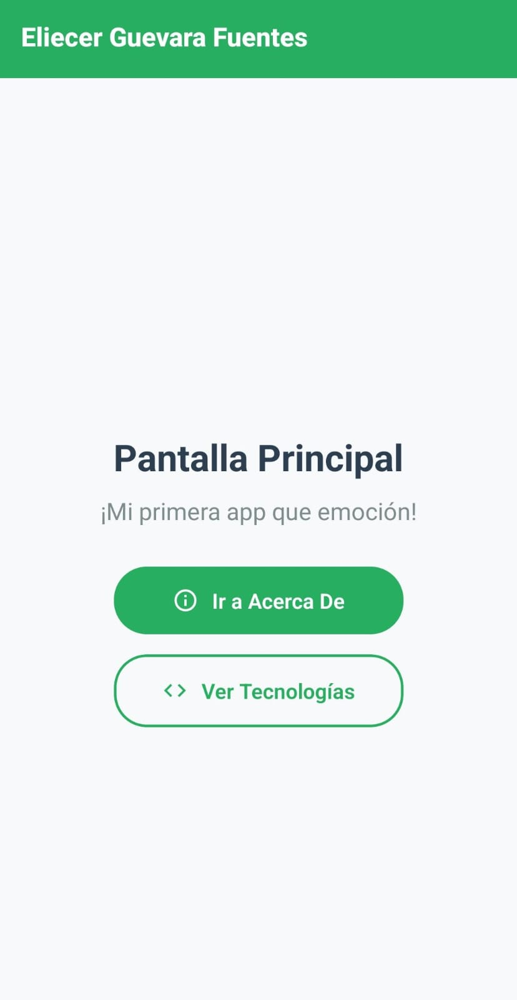
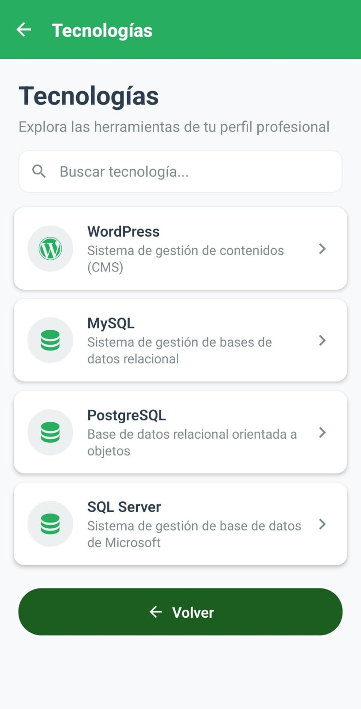
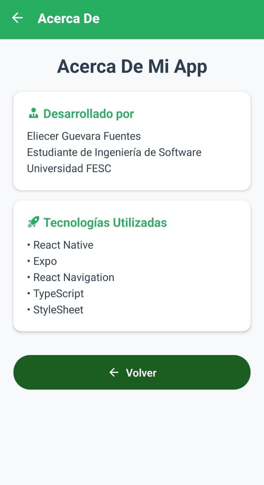

# Mi Primera App - Eliecer Guevara Fuentes 🚀

## 👨‍💻 Perfil Profesional
**Eliecer Guevara Fuentes**  
Estudiante de Ingeniería de Software | Universidad FESC  
Especialista en soluciones digitales y gestión de datos.

---

## 📱 Descripción del Proyecto
Este proyecto es una aplicación móvil robusta y elegante desarrollada con **React Native** y **Expo**. La interfaz ha sido personalizada con una paleta de colores **Verde Esmeralda** y un enfoque en tecnologías de gestión de contenidos y bases de datos.

### 🎯 Características Destacadas
- **Paleta Verde Premium:** Diseño visual armonioso y moderno.
- **Gestión de Tecnologías:** Visualización detallada de herramientas como WordPress y sistemas SQL.
- **Navegación Intuitiva:** Sistema de rutas fluido con botones de retorno integrados.
- **Arquitectura Limpia:** Estructura modular basada en el patrón de diseño de frameworks modernos.

---

## 📸 Galería de Evidencias
Visualiza el resultado final de la aplicación en sus diferentes secciones:

| Pantalla de Inicio | Listado de Tecnologías | Acerca de la App |
| :---: | :---: | :---: |
|  |  |  |

---

## 🛠️ Stack Tecnológico
- **Frontend:** React Native & Expo.
- **Lenguaje:** TypeScript.
- **Estilos:** StyleSheet dinámico con soporte de temas.
- **Iconografía:** Material Community Icons.

---

## 🏗️ Organización del Proyecto
El código está organizado de manera profesional para facilitar su escalabilidad:

```text
src/
├── components/   # Componentes modulares
├── screens/      # Pantallas de la aplicación
├── navigation/   # Configuración de rutas
├── data/         # Información de perfil y tecnologías
├── context/      # Estado global de la aplicación
└── styles/       # Sistema de diseño y colores verdes
```

---

## 🚀 Instalación y Ejecución
1. **Clonación:** Descarga el código fuente.
2. **Dependencias:**
   ```bash
   npm install
   ```
3. **Arranque:**
   ```bash
   npx expo start
   ```
4. **Visualización:** Escanea el código QR en **Expo Go** desde tu dispositivo móvil.

---
*© 2026 - Universidad FESC - Eliecer Guevara Fuentes*
